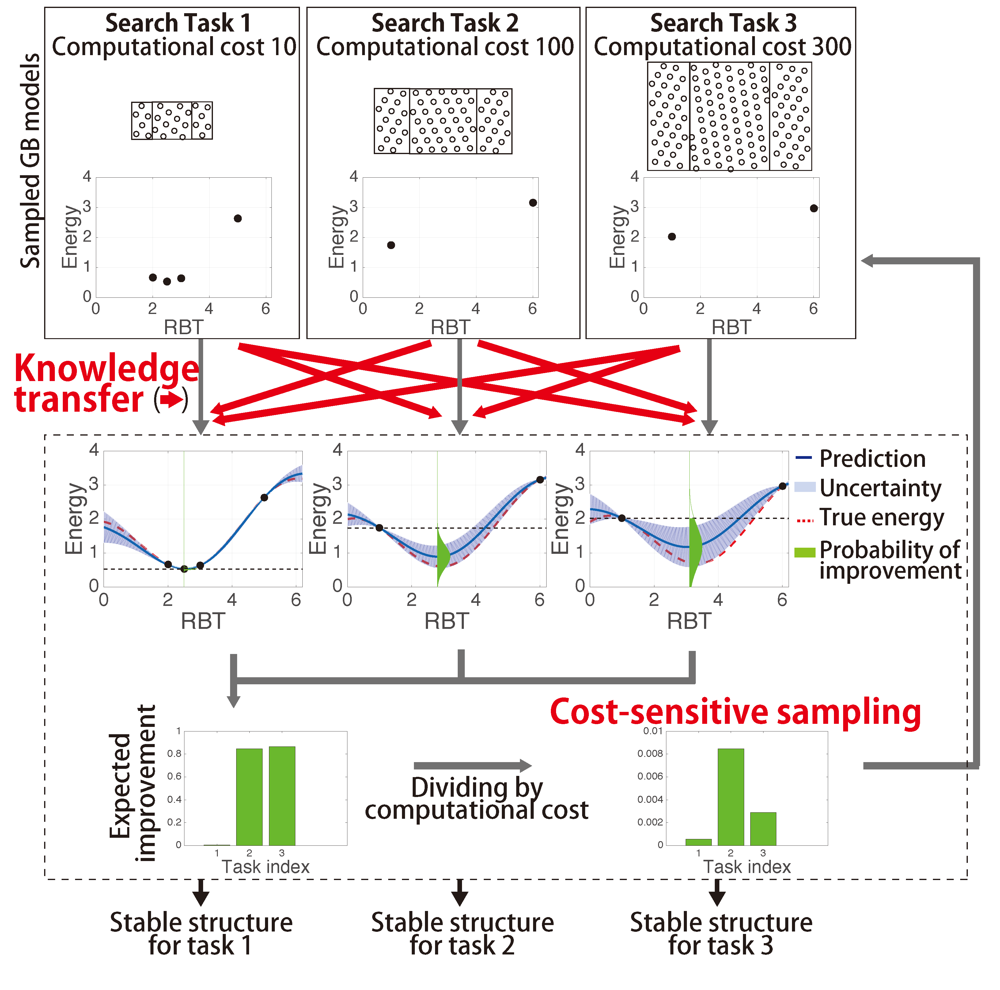

# Cost-sensitiveMulti-taskBO
Knowledge-Transfer-Based Cost-Effective Search for Interface Structures

## Abstract

Determining the atomic configuration of an interface is one of the most important issues in materials science research. Although theoretical simulations are effective tools, an exhaustive search is computationally prohibitive due to the high degrees of freedom of the interface structure. In the interface structure search, multiple energy surfaces created by a variety of orientation angles need to be explored, and the necessary computational costs for different angles vary substantially owing to significant variations in the supercell sizes. To overcome this difficulty, we introduce two machine-learning concepts, transfer learning and cost-sensitive search, to our interface-structure search mehod called cost-sensitive multi-task Bayesian optimization (CMB).

The basic idea of transfer learning is to transfer knowledge among different (but related) tasks to improve the efficiency of machine-learning methods. A grain boundary (GB) structure search for a fixed angle is considered to be a ``task''. When a set of tasks are similar to each other, information accumulated for one specific task can be useful for other tasks. In our structure-search problem, a sampled GB model for an angle provides information for other angles because of the energy-surface similarity. Futher, CMB incorporates cost information into the sampling decision, meaning that we evaluate each candidate based on both the possibility of an energy improvement and the cost of sampling. By combining the cost-sensitive search with transfer learning, CMB accumulates information by sampling low cost surfaces in the initial stage of the search, and can identify the stable structures in high cost surfaces with a small number of sampling steps by using the transferred surface information.

The code currently available here is to reproduce our results on fcc-Al [110] tilt grain boundary. We are planing to update our code so that it can apply to other systems for practical use.

## Environmental Requirement
- Python version 2.7.15

## Usage
`python run_GBopt.py [option]`

### Option
- Exp : name for log-file
- Loop : number of BO loop
- init_num : you can set the position of initial training points by choosing from 0 to 99
- -c : use cost-sensitive acquisition function
- -l : use log-scaled energy
- -h : display help for arguments

### Example
`python run_GBopt.py MB Exp1 500 1 -c -l`

## Lisence
GNU General Public License